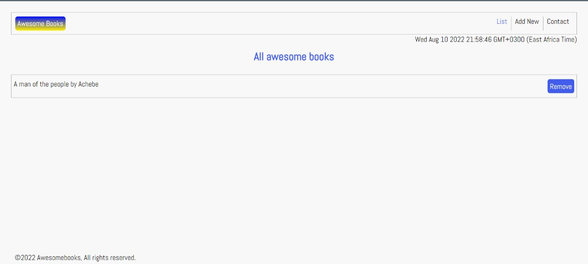

# Preview

# awesome-Books
An application to add, store and remove books to and from local storage. This application is built with technologies such as Bootstrap, CSS and javascript. I t allows users to keep track of books; They can add a book, edit the book input and remove a book if they want to.

# Live Demo
[Live Demo](https://tingamapuro04.github.io/awesome-Books/)

# Getting started
To get a local copy up and running, follow these simple example steps.

# Prerequisites
- A web browser (eg Mozilla Firefox, Google chrome etc)
- git => This is a version control system used for code source management.
- A text editior eg vscode(recommended) or atom etc.
- Basic knowledge on html, javascript and css.

# Set Up
- With git, clone the code to your machine, or download the files directly.
- git clone [@github](tingamapuro04/Portfolio.git)
- Once the files are on your machine, open the project Portfolio folder in the text esditor.
- After opening the files, open the terminal and run this command npm start

# Built With
- Languages - HTML, CSS and Javascript
- Frameworks - Boostrap
- Technologies - Web Technology
- Other tools - HTML & CSS Linters

# Contributing
Feel free to check out the Issues page

# Show your support
Give a star if you like this project

# Acknowledgement
 [Microverse](https://www.microverse.org/?grsf=i6yi2m)
 
# License
This project is MIT licensed.

# Authors
**Alphonce Mobutu**
1. [Alphonce Mobutu](https://github.com/tingamapuro04)
2. [Agasha Bornittah](https://github.com/Bornittah)
